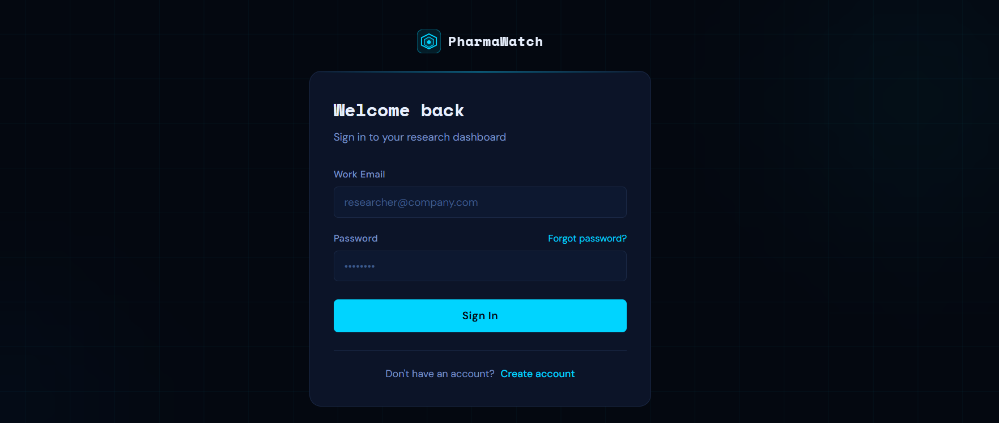
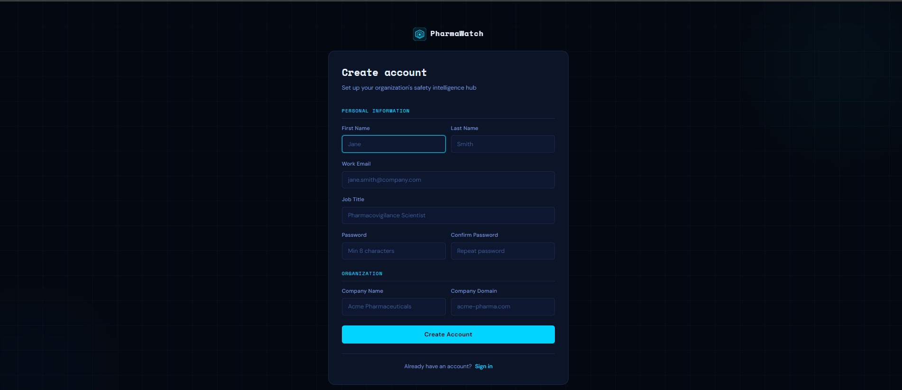
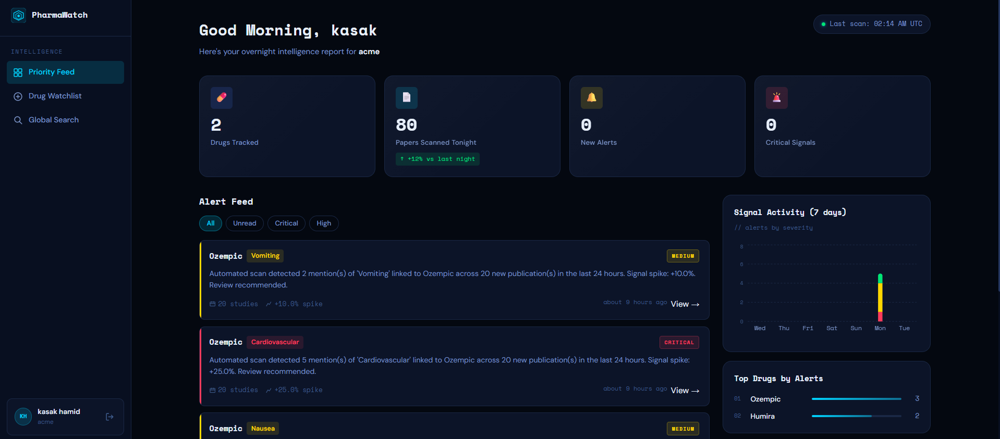
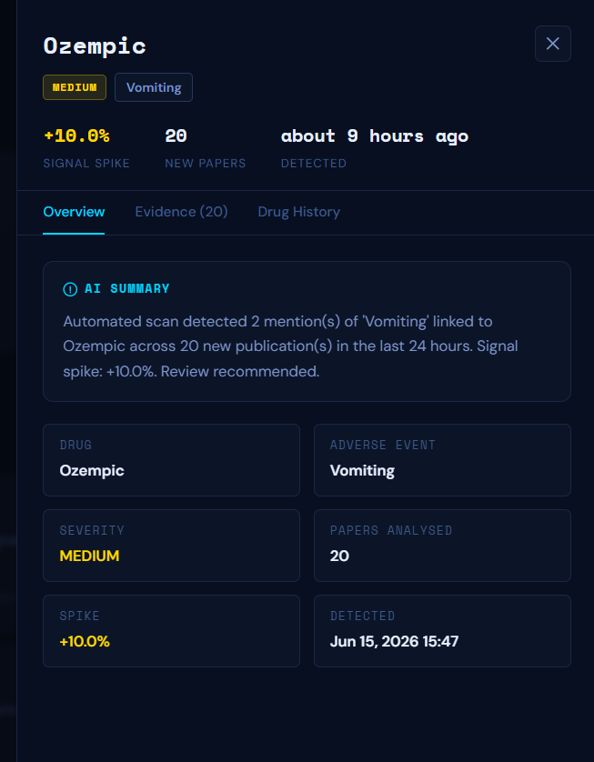
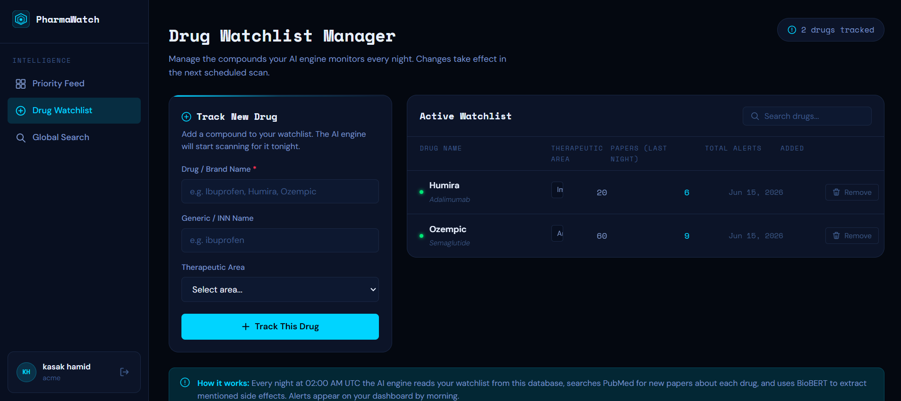
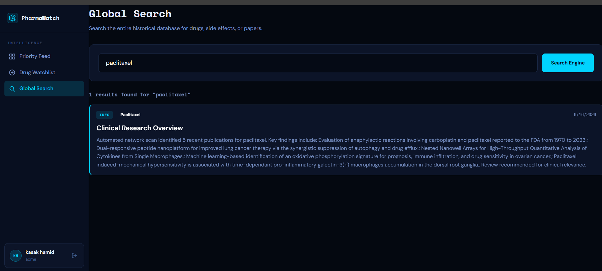

# PharmaWatch – Automated Biomedical Intelligence Platform

## Overview

PharmaWatch is an AI-powered biomedical intelligence platform designed for pharmaceutical companies to continuously monitor drug-related research and emerging safety signals.

Every day, thousands of clinical and biomedical research papers are published across journals and repositories. Manually reviewing this volume of literature is time-consuming, expensive, and often results in important findings being overlooked.

PharmaWatch automates the process of collecting, analyzing, and synthesizing biomedical research. Using Natural Language Processing (NLP) and BioBERT-based AI models, the system identifies drug mentions, extracts reported side effects, and generates actionable insights through an interactive dashboard.

Instead of manually reading hundreds of research papers, pharmaceutical companies can maintain a customized watchlist of drugs and receive prioritized alerts, helping them identify emerging safety concerns, monitor competitor drugs, and make evidence-based decisions faster.

---

# Problem Statement

Pharmaceutical organizations face a significant challenge in monitoring newly published biomedical literature.

Thousands of research papers are published every week, making it nearly impossible for safety teams and researchers to manually review every publication. As a result:

* Critical adverse drug reactions may go unnoticed.
* Newly discovered side effects can remain buried within unstructured text.
* Pharmacovigilance teams spend excessive time reviewing literature manually.
* Competitor drug developments can be overlooked.
* Regulatory and compliance risks increase.
* Valuable scientific evidence remains underutilized.

An automated system is required to continuously monitor biomedical publications, extract relevant drug-safety information, and provide timely, evidence-based insights.

---

# Motivation

The motivation behind PharmaWatch is to help pharmaceutical companies transform overwhelming volumes of biomedical research into actionable intelligence.

By leveraging Artificial Intelligence and Biomedical NLP, organizations can:

* Monitor drug safety trends automatically.
* Detect emerging adverse effects earlier.
* Track competitor drugs and related research.
* Reduce manual literature review efforts.
* Improve pharmacovigilance workflows.
* Support faster, data-driven business decisions.

The project demonstrates how AI-powered knowledge synthesis can improve the efficiency of modern pharmaceutical research and safety monitoring operations.

---

# Key Features

### Secure Authentication

* Corporate user login and registration system.
* Secure authentication and authorization.
* Company-specific data isolation.

### Smart Dashboard

* Displays key monitoring metrics.
* Shows tracked drug statistics.
* Highlights newly analyzed papers.
* Displays critical safety alerts.

### Automated Alert Feed

* Prioritized list of significant findings.
* Detection of unusual side-effect trends.
* Daily updates based on newly processed research.

### Deep-Dive Analysis Panel

* Detailed investigation view for each alert.
* Historical side-effect trend visualization.
* Evidence-backed research summaries.
* Direct access to original biomedical publications.

### Portfolio Watchlist Management

* Add new drugs to monitor.
* Remove existing drugs.
* Manage company-specific tracking portfolios.
* Monitor competitor medications.

### Global Search System

* Search across all historical biomedical data.
* Query by drug name.
* Query by side effect.
* Apply date-based filtering.

### AI-Powered Information Extraction

* Biomedical text processing using BioBERT.
* Named Entity Recognition (NER).
* Drug and adverse event extraction.
* Automated knowledge synthesis.

---

# System Architecture

```text
                    ┌─────────────────────┐
                    │     React Frontend  │
                    └──────────┬──────────┘
                               │
                               ▼
                    ┌─────────────────────┐
                    │ Spring Boot Backend │
                    └──────────┬──────────┘
                               │
               ┌───────────────┼───────────────┐
               │                               │
               ▼                               ▼
    ┌───────────────────┐          ┌───────────────────┐
    │ PostgreSQL DB     │          │ Python AI Engine  │
    └───────────────────┘          └─────────┬─────────┘
                                              │
                                              ▼
                               ┌─────────────────────────┐
                               │ BioBERT NLP Processing │
                               └─────────┬──────────────┘
                                         │
                                         ▼
                               ┌─────────────────────────┐
                               │ Biomedical Literature   │
                               │ (PubMed / Research Data)│
                               └─────────────────────────┘
```

---

# Methodology

### Step 1: Drug Watchlist Creation

Users create and manage a watchlist containing drugs they wish to monitor.

### Step 2: Research Collection

The system gathers newly published biomedical literature relevant to tracked drugs.

### Step 3: Text Processing

Research abstracts and article content are processed using NLP techniques.

### Step 4: Information Extraction

BioBERT identifies:

* Drug names
* Side effects
* Adverse reactions
* Biomedical entities

### Step 5: Knowledge Synthesis

Extracted findings are structured and stored within PostgreSQL.

### Step 6: Alert Generation

The system detects significant changes and generates actionable alerts.

### Step 7: Visualization

Insights are presented through dashboards, charts, and analytical views.

---

# Technology Stack

## Frontend

* React.js
* React Router
* Recharts
* Axios
* Tailwind CSS

## Backend

* Java Spring Boot
* Spring Security
* Spring Data JPA
* REST APIs

## Database

* PostgreSQL

## AI & NLP

* Python
* BioBERT
* Hugging Face Transformers
* Pandas
* NumPy

## Development Tools

* Git
* GitHub
* Docker

---

# Project Structure

```text
PHARMAWATCH/
│
├── frontend/
├── backend/
├── ai-engine/
├── .env
├── .env.example
├── docker-compose.yml
├── docker-compose.dev.yml
└── README.md
```

---

# Screenshots

## Login Page



---

## Registration Page



---

## Main Dashboard



---

## Alert Details (Deep Dive Panel)



---

## Watchlist Manager



---

## Global Search



---

# Installation

## Clone the Repository

```bash
git clone https://github.com/your-username/pharmawatch.git
cd pharmawatch
```

## Frontend Setup

```bash
cd frontend
npm install
npm start
```

## Backend Setup

```bash
cd backend
mvn clean install
mvn spring-boot:run
```

## Database Setup

```sql
CREATE DATABASE pharmawatch;
```

Configure PostgreSQL in:

```properties
application.properties
```

```properties
spring.datasource.url=jdbc:postgresql://localhost:5432/pharmawatch
spring.datasource.username=postgres
spring.datasource.password=your_password
```

## AI Engine Setup

```bash
cd ai-engine
pip install -r requirements.txt
python main.py
```

---

# Author

**Saina Hamid**
